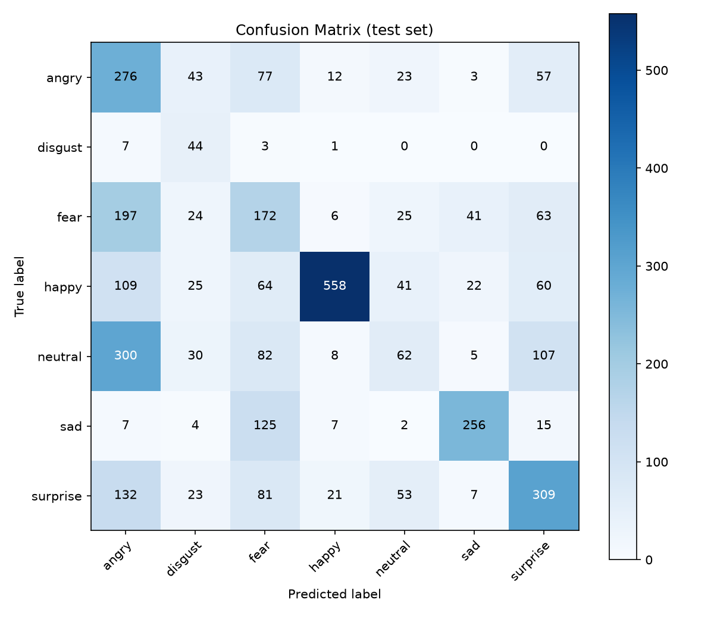

# Emotion Detection — from training to on-device deployment

Facial emotion recognition on FER2013: classify a face photo into one of 7 emotions — angry, disgust, fear, happy, neutral, sad, surprise.

Full ML engineering cycle: data preparation → training → evaluation → INT8 quantization → Core ML export → browser demo.

## Results

| architecture | params | FP32 accuracy | INT8 accuracy | FP32 size (MB) | INT8 size (MB) | latency FP32 (ms) | latency INT8 (ms) |
|---|---|---|---|---|---|---|---|
| **EmotionCNN** (primary) | 1,701,607 | **46.7%** | 46.9% | 6.50 | 2.75 | 1.36 ± 0.28 | 1.68 ± 0.64 |
| MobileNetV3-Small (transfer) | 1,526,567 | 34.5% | — | 4.24 | — | — | — |

Metrics on FER2013 PrivateTest (3,589 images). CNN outperforms MobileNetV3 on 48×48 grayscale — ImageNet pretraining doesn't transfer well at this resolution.

Macro F1 (CNN): **0.444**

### Confusion matrix



### Error analysis

- **happy** and **sad** are the strongest classes (F1 0.75 and 0.68). The model reliably picks up broad positive/negative affect.
- **neutral** is the weakest (F1 0.16, recall 10%). Neutral faces are often misclassified as happy or sad — a common FER2013 failure mode when expressions are subtle.
- **fear** ↔ **sad** confusion: fear has low recall (33%) and gets pulled toward sad and surprise, which share similar brow/eye geometry.
- **disgust** is the rarest class (1.5% of train). High recall (80%) but low precision (23%) — the model over-predicts disgust when uncertain.
- **angry** has decent recall (56%) but low precision (27%) — angry faces are confused with fear and sad.

Test accuracy (~47%) is below SOTA (~75%) and the human-level benchmark (~65%). Honest baselines for an iterative portfolio project.

### Memory-efficient data loading

CSV splits are lazily converted to `.npz` and loaded via `numpy` memory-mapped arrays (~61 MB train split vs ~250 MB in pandas). Training defaults to `batch_size=32` and `num_workers=0` to keep RAM usage low.

## Project structure

```
emotion-detection/
  data/                  # FER2013 CSV splits (gitignored)
  src/
    dataset.py           # FER2013Dataset + WeightedRandomSampler
    model.py             # EmotionCNN + MobileNetV3
    train.py             # training with early stopping
    evaluate.py          # metrics + confusion matrix
    quantize.py          # FP32 → INT8 + Core ML export
    export_web.py        # ONNX export for browser demo
    serve.py             # FastAPI serving (optional)
  tests/
  demo/                  # browser demo (ONNX Runtime Web)
  models/                # checkpoints (gitignored)
```

## Setup

```bash
python3 -m venv .venv
source .venv/bin/activate
pip install -r requirements.txt
pip install -e .   # optional, removes need for PYTHONPATH
```

## Download data

```bash
python scripts/download_fer2013.py
```

Downloads FER2013 from HuggingFace (`DerrickUnleashed/FER-2013`) with native Training / PublicTest / PrivateTest splits (35,887 images, 48×48 grayscale).

## Train

```bash
python src/train.py                        # baseline CNN
python src/train.py --arch mobilenet_v3      # transfer learning experiment
```

Adam + ReduceLROnPlateau, batch size 32, early stopping (patience=7). Checkpoints: `models/best_{arch}.pt`.

## Evaluate

```bash
python src/evaluate.py --checkpoint models/best_cnn.pt
```

## Quantize + Core ML

```bash
python src/quantize.py --checkpoint models/best_cnn.pt
```

Exports `models/emotion_cnn_fp32.mlpackage` and `models/emotion_cnn_int8.mlpackage`.

## Web demo

```bash
python src/export_web.py --checkpoint models/best_cnn.pt
cd demo && python -m http.server 8080
```

Open http://localhost:8080 — camera access + real-time inference via ONNX Runtime Web.

## API (optional)

```bash
uvicorn src.serve:app --reload
```

- `POST /predict` — upload image, get emotion probabilities
- `GET /metrics` — request count + avg confidence (data drift monitoring stub)

## Tests

```bash
pytest -v
```

## Stack

Python 3.11+, PyTorch 2.x, coremltools, ONNX Runtime Web, FastAPI, pytest

## Author

Natalia Agapova — [portfolio](https://github.com/natagapova/natagapova)
